# TryHackMe: John the Ripper — The Basics

**Path:** Cyber Security 101 → Cryptography → John the Ripper: The Basics
**Difficulty:** Premium room
**Focus:** Hash identification, dictionary attacks, Windows/Linux credential cracking, custom rules, and cracking protected archives & SSH keys

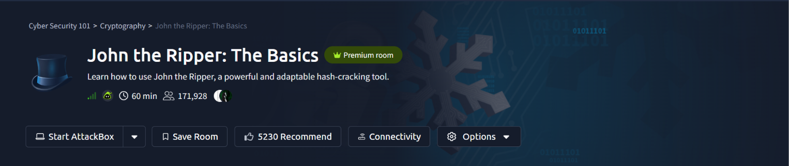

`John the Ripper` (JtR) is one of the most widely used offline password-cracking tools in security — capable of identifying hash types, running dictionary and rule-based attacks, and cracking everything from OS credentials to encrypted archives and SSH keys. This room walks through all of it hands-on.

---

## Task 2/3 — Background: Jumbo John & Wordlists

Before diving into commands, the room covers two foundational facts:


The most widely used extended build of John the Ripper adds support for hundreds of additional hash and cipher formats beyond the base tool — this is the version installed on most pentesting distros like Kali.

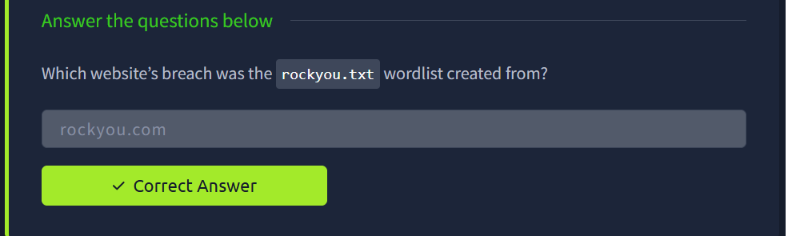

`rockyou.txt` — the wordlist used throughout this entire room — originates from a real-world data breach, which is exactly why it's so effective: it contains millions of passwords real people actually used.

---

## Task 4 — Identifying & Cracking Unknown Hashes

This task works through four unknown hash files, each requiring identification before it can be cracked. The general workflow is: **identify the hash type → run John with the matching `--format` → read the cracked value.**

### hash1.txt

```bash
cd John-the-Ripper-The-Basics/Task04/
ls
cat hash1.txt
```

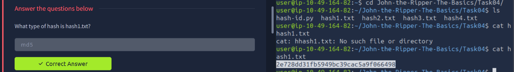

The hash format (32 hex characters, no salt) points to raw **MD5**.

```bash
john --format=raw-md5 --wordlist=/usr/share/wordlists/rockyou.txt hash1.txt
```

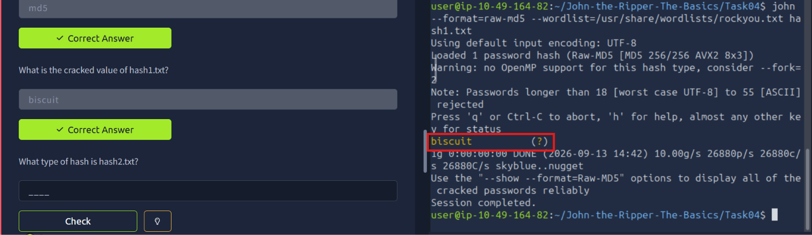

### hash2.txt

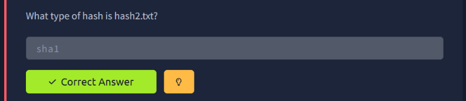

This one's a raw **SHA-1** hash (40 hex characters).

```bash
john --format=raw-sha1 --wordlist=/usr/share/wordlists/rockyou.txt hash2.txt
```

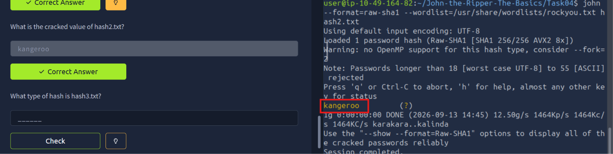

### hash3.txt

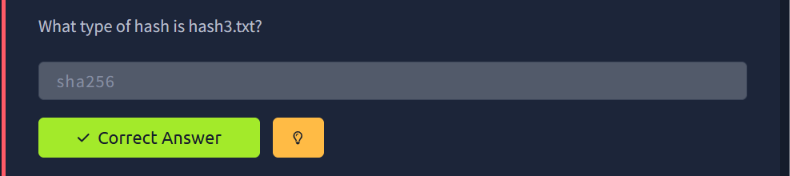

64 hex characters — raw **SHA-256**.

```bash
john --format=raw-sha256 --wordlist=/usr/share/wordlists/rockyou.txt hash3.txt
```

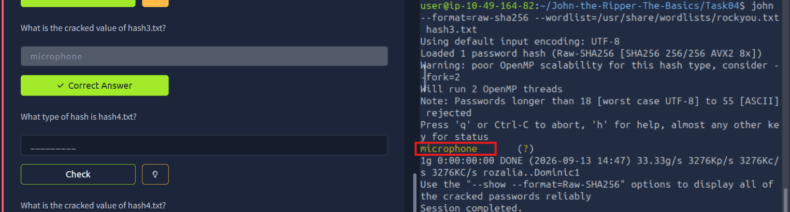

### hash4.txt

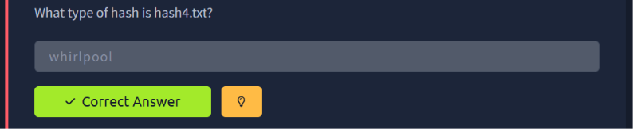

A 128-character hex string — **Whirlpool**, a less common but still crackable digest algorithm.

```bash
john --format=whirlpool --wordlist=/usr/share/wordlists/rockyou.txt hash4.txt
```

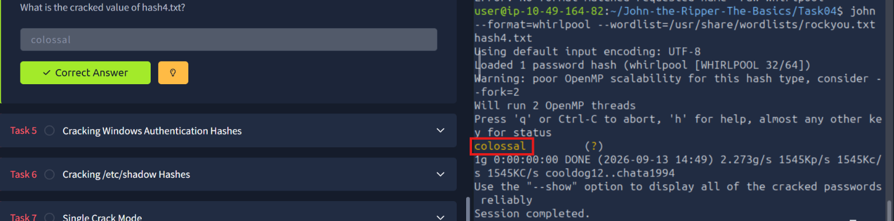

Across all four hashes, the pattern is identical: spot the hash's structural fingerprint (length, character set, delimiters), pick the matching `--format`, and let John chew through the wordlist.

---

## Task 5 — Cracking Windows Authentication Hashes (NTLM)

Windows stores password hashes in NTLM format, which John identifies using the `--format=nt` flag.

```bash
cat ntlm.txt
john --format=nt --wordlist=/usr/share/wordlists/rockyou.txt ntlm.txt
```

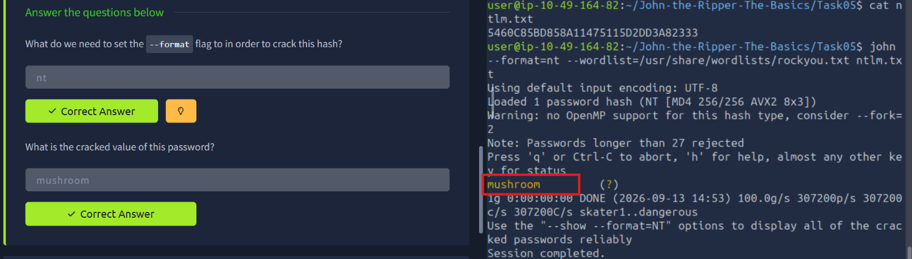

NTLM hashes use MD4 internally and — unlike properly salted modern hashes — crack extremely fast, which is a major reason NTLM is considered weak by modern standards.

---

## Task 6 — Cracking /etc/shadow Hashes

Linux stores password hashes in `/etc/shadow`, which isn't crackable directly without first merging it with `/etc/passwd` using `unshadow`.

```bash
unshadow local_passwd local_shadow > unshadowed.txt
john --format=sha512crypt --wordlist=/usr/share/wordlists/rockyou.txt unshadowed.txt
john --show unshadowed.txt
```

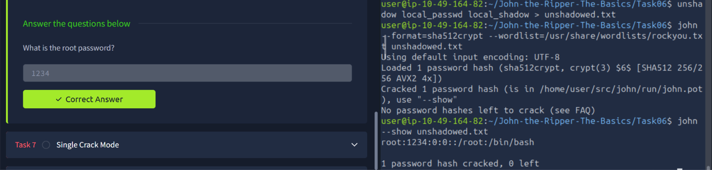

The combined file lets John match usernames to their corresponding hashes and crack them exactly like a standalone hash file, recovering the root account's password.

---

## Task 7 — Single Crack Mode

Instead of running straight dictionary attacks, John's **single crack mode** uses contextual information — like a username — to generate highly targeted password guesses (e.g., trying variations of the username itself, a technique that catches surprisingly weak real-world passwords).

```bash
echo "Joker:<hash>" > hash07.txt
cat hash07.txt
john --single --format=raw-md5 hash07.txt
```

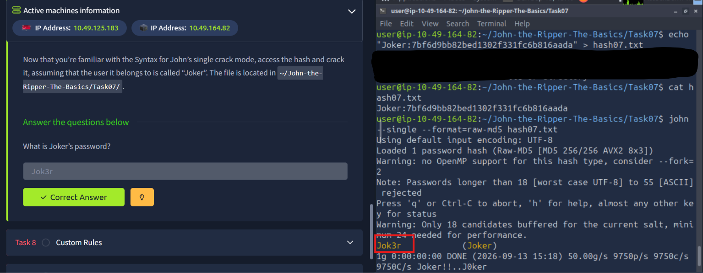

Since John knows the username is "Joker," single crack mode automatically tries permutations related to that name — and cracks it almost instantly.

---

## Task 8 — Custom Rules

John's rule engine lets you programmatically mutate wordlist entries (appending numbers, capitalizing letters, leetspeak substitutions, etc.) to model realistic human password habits without needing a bigger wordlist.

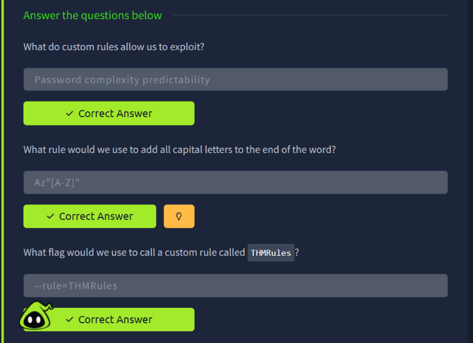

Custom rules directly exploit the predictability of how humans modify passwords to "meet complexity requirements" (e.g., capitalizing the first letter, appending `!` or a year). Rules are defined in John's config file and invoked at runtime with the `--rule=<RuleName>` flag.

---

## Task 9 — Cracking Password-Protected ZIP Files

John can crack encrypted archive passwords directly, without needing to extract them first — it just needs the archive's hash extracted into a crackable format.

```bash
john --wordlist=/usr/share/wordlists/rockyou.txt secure.zip
```

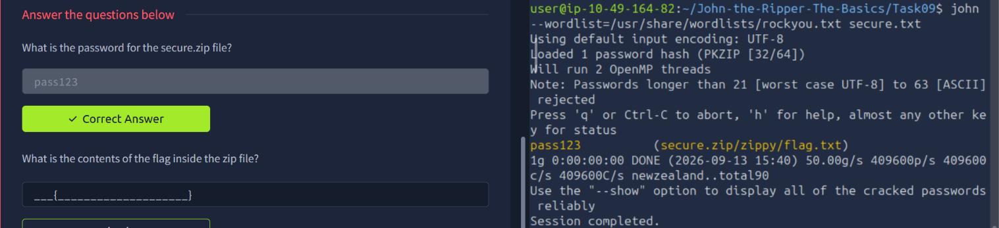

With the ZIP password recovered, extracting and reading the flag confirms success:

```bash
unzip secure.zip
cd zippy
cat flag.txt
```

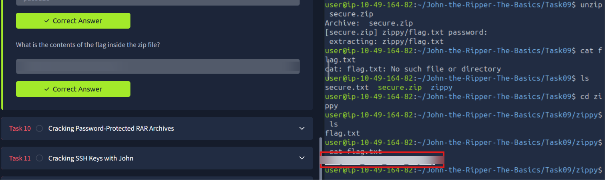

*(Flag redacted above — crack it yourself!)*

---

## Task 10 — Cracking Password-Protected RAR Archives

RAR archives follow the same pattern but need their hash extracted first using `rar2john`.

```bash
rar2john secure.rar > secure.txt
john --wordlist=/usr/share/wordlists/rockyou.txt secure.txt
```

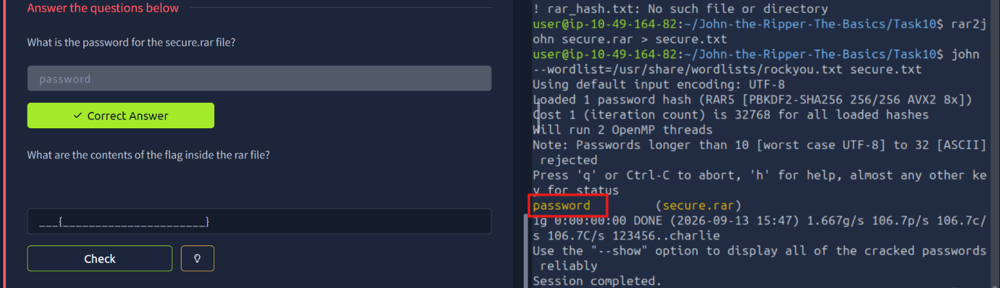

```bash
unrar x secure.rar
cat flag.txt
```

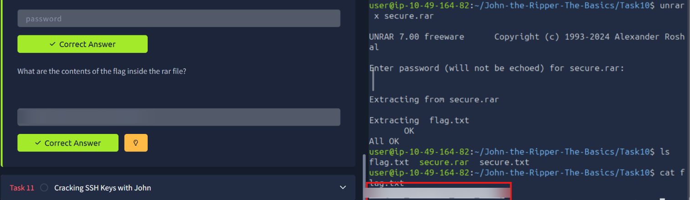

*(Flag redacted above — same deal, crack it yourself!)*

---

## Task 11 — Cracking SSH Private Key Passwords

The final practical task tackles password-protected SSH private keys, using John's dedicated `ssh2john` converter script to extract a crackable hash from the key file.

```bash
/opt/john/ssh2john.py id_rsa > id_rsa_hash.txt
john --wordlist=/usr/share/wordlists/rockyou.txt id_rsa_hash.txt
```

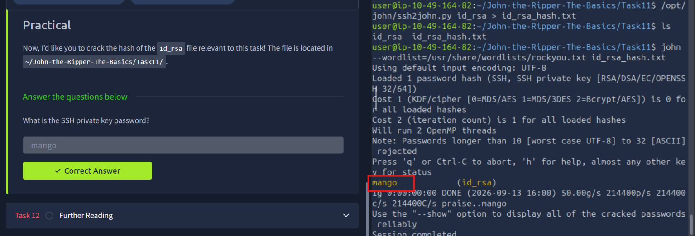

This is a genuinely useful real-world technique — encountering a passphrase-protected `id_rsa` during an engagement is common, and `ssh2john` + John is the standard way to attempt recovering it offline.

---

## Summary

| Hash / Target | Format Used | Technique |
|---|---|---|
| hash1.txt | `raw-md5` | Dictionary attack |
| hash2.txt | `raw-sha1` | Dictionary attack |
| hash3.txt | `raw-sha256` | Dictionary attack |
| hash4.txt | `whirlpool` | Dictionary attack |
| NTLM hash | `nt` | Dictionary attack |
| /etc/shadow | `sha512crypt` (via `unshadow`) | Dictionary attack |
| Username-based hash | `raw-md5` | Single crack mode |
| ZIP archive | N/A (auto-detected) | Dictionary attack |
| RAR archive | N/A (via `rar2john`) | Dictionary attack |
| SSH private key | N/A (via `ssh2john`) | Dictionary attack |

This room is a genuinely comprehensive tour of John the Ripper's core capabilities — from raw hash identification all the way through to cracking real-world artifacts like encrypted archives and SSH keys. The recurring theme throughout: identify the format correctly, and the rest is just picking the right wordlist (or rule set) for the job.

---

*Both room flags have been redacted from screenshots — every command, hash format, and cracking technique is shown in full so you can reproduce the entire walkthrough yourself.*
